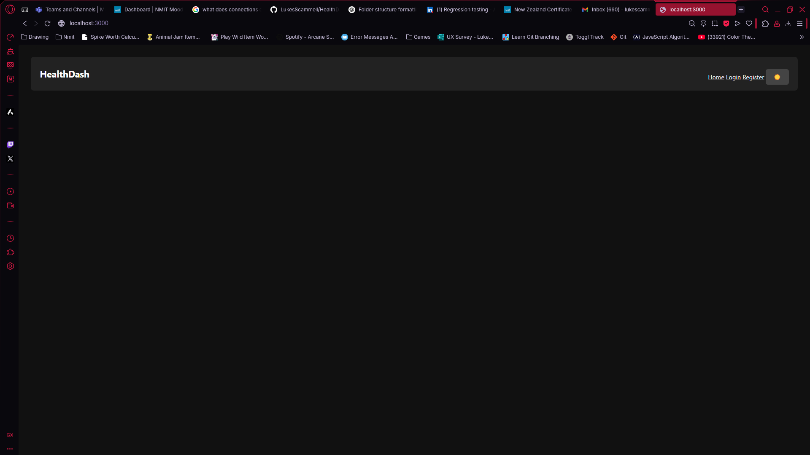
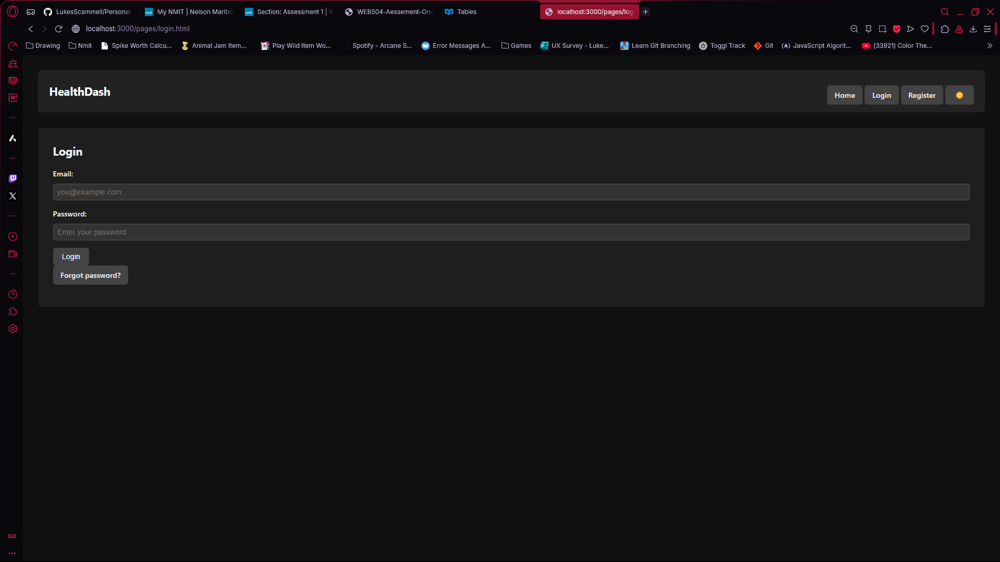

#
# 📝 About This Project

This project was initially developed using ChatGPT in the browser to generate some of the website's foundational code and structure. Later, development was transitioned to GitHub Copilot in Visual Studio Code, which made adding new features, fixing bugs, and iterating on the design much easier and faster. Copilot's integration with VS Code provided a more streamlined workflow and improved productivity throughout the build process.
#
# 🧑‍💻 Seeded User Accounts

The following user accounts are seeded for testing and demo purposes:

| Email               | Password |
|---------------------|----------|
| alice@email.com     | test123  |
| bob@email.com       | test123  |
| luke@email.com      | test123  |
| provider1@email.com | test123  |

# HealthDash-Patientracker
I will be using Html and css to format the javascript i wrote for assement 2 sdv

## 🚀 Project Structure
```text
HealthDash-Patientracker/
├── client/                     # Frontend
│   ├── images/                 # Static images
│   │   ├── amoxicillin.png
│   │   ├── antihistamines.jpg
│   │   ├── antivirals.jpg
│   │   ├── ibuprofen.png
│   │   ├── inhaler.png
│   │   ├── insulin.png
│   │   ├── paracetamol.png
│   │   ├── ssri.jpg
│   │   └── triptans.jpg
│   ├── pages/                  # HTML pages
│   │   ├── forgot-password.html
│   │   ├── index.html
│   │   ├── login.html
│   │   ├── nav.html
│   │   ├── patient-profile.html
│   │   ├── patients.html
│   │   ├── provider-patients.html
│   │   ├── providers.html
│   │   ├── register.html
│   │   └── users.html
│   ├── css/
│   │   └── style.css
│   ├── js/
│   │   └── script.js
│   └── assets/                 # Fonts, icons, etc.
├── server/                     # Backend
│   ├── data/
│   │   ├── patients.json
│   │   ├── providers.json
│   │   └── users.json
│   ├── middleware/
│   ├── models/
│   ├── routes/                 # Route handlers
│   ├── seed/                   # Seed & utility scripts
│   │   ├── seed.js                     # Main MongoDB seed script
│   │   ├── seed-patients.js            # Patient-only seeder
│   │   ├── print-patient-usernames.js  # Utility to print patient usernames
│   │   └── seed-admin.js               # (If present) Admin seeder/utility
│   └── server.js               # Main Express server
```

## 📄 Pages Overview

| Page                      | Path                        | Description  | Page Image|                               
|---------------------------|-----------------------------|----------|-----------------|
| Home                      | /pages/index.html           | Landing page, general info                  |         |
| Login                     | /pages/login.html           | User login form                             |         |
| Register                  | /pages/register.html        | New user registration                       |   |
| Forgot Password           | /pages/forgot-password.html | Password reset form                         |                                                |
| Users                     | /pages/users.html           | User management (admin)                     |                                                |
| Patients                  | /pages/patients.html        | Patient list (admin/provider)               |                                                |
| Patient Profile           | /pages/patient-profile.html | Patient's personal profile & prescriptions  |                                                |
| Providers                 | /pages/providers.html       | Provider list (admin)                       |                                                |
| Provider Patients         | /pages/provider-patients.html| Provider's assigned patients               |                                                |
| Navigation                | /nav.html                   | Navigation bar (included in all pages)      |                                                |

